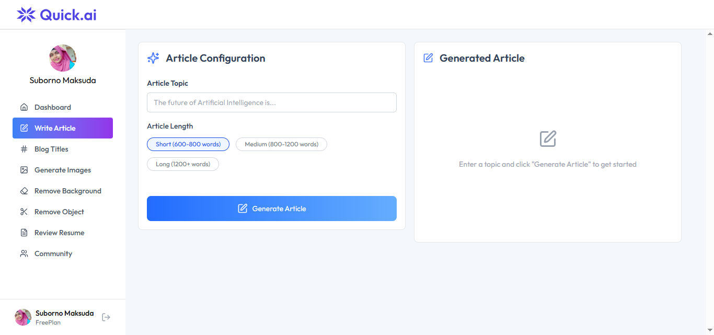

# Quick.Ai

Quick.Ai is a **React + Tailwind CSS** powered frontend application that brings together **6 powerful AI tools** into a single platform. User can share their created image in the community platform also.  
It provides seamless **user authentication** and a **billing system** powered by [Clerk](https://clerk.com), ensuring both free and premium access to AI tools.

---

  

## Features

- **Authentication with Clerk** – Secure login/signup for users  
- **6 AI Tools in One Platform**:
  -  Article Writer  
  -  Blog Title Generator  
  -  Image Generator  
  -  Background Removal  
  -  Object Removal  
  -  Resume Reviewer  
-  **Billing System with Clerk**  
  - Free users can explore **2 tools**  
  - Premium users can unlock **all 6 tools**  
-  Responsive design for mobile, tablet, and desktop  

---

##  Tech Stack

- **React.js** – Frontend framework  
- **Tailwind CSS** – Styling  
- **Clerk** – Authentication & Billing management

##  Screenshots

| Home Page | Article Writing Page |
|-----------|--------------|
|  |  |

| Dashboard | Community |
|--------------|------------|
|  |  |
